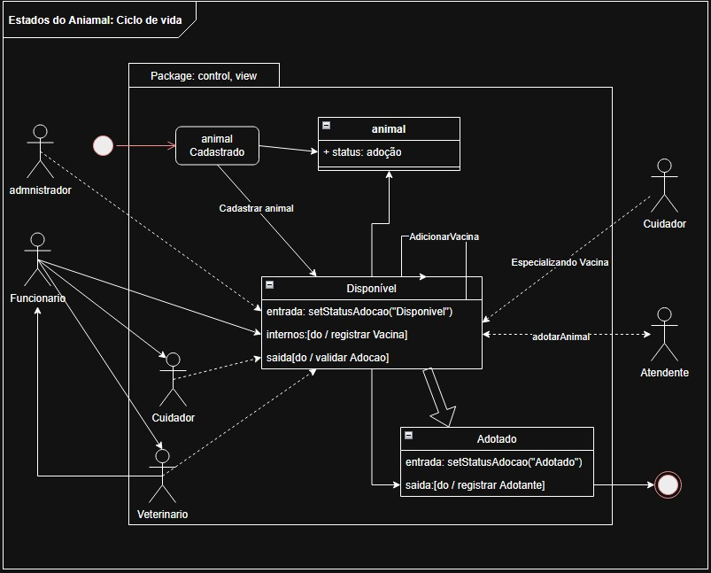
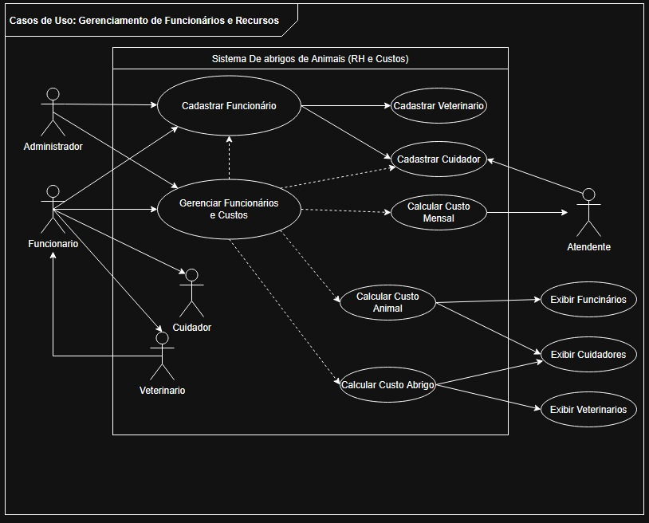
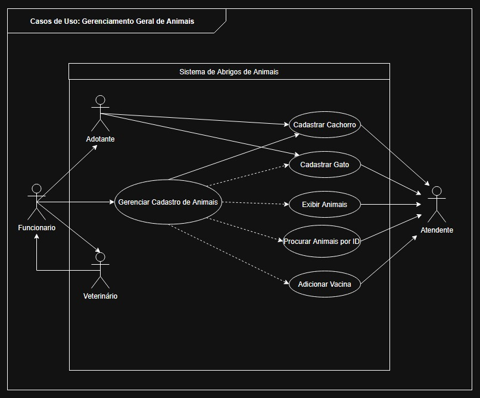
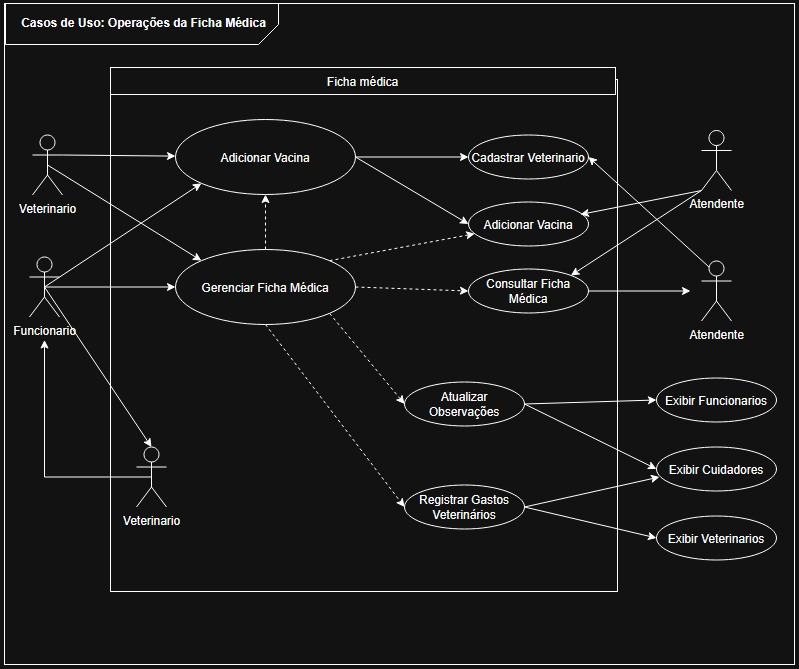
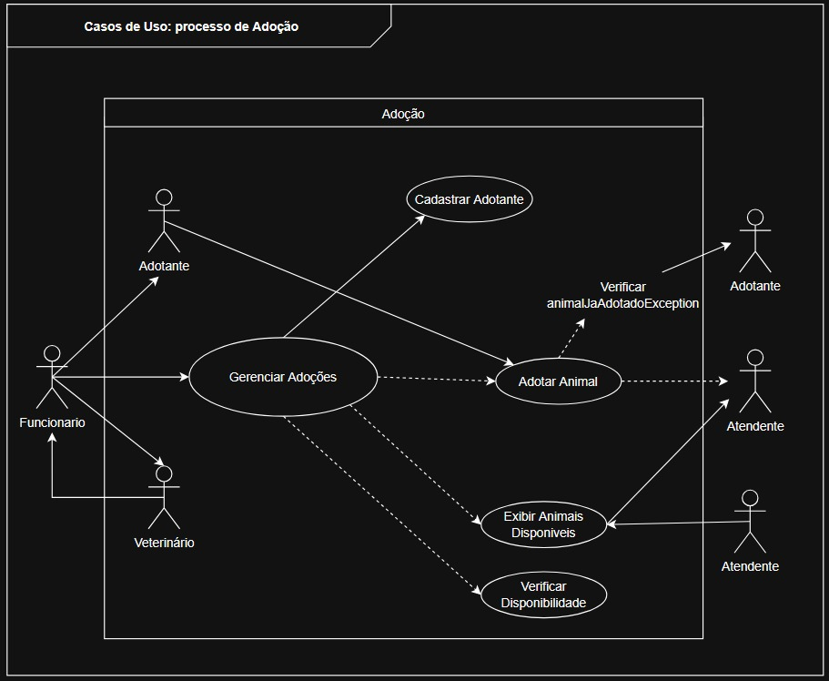
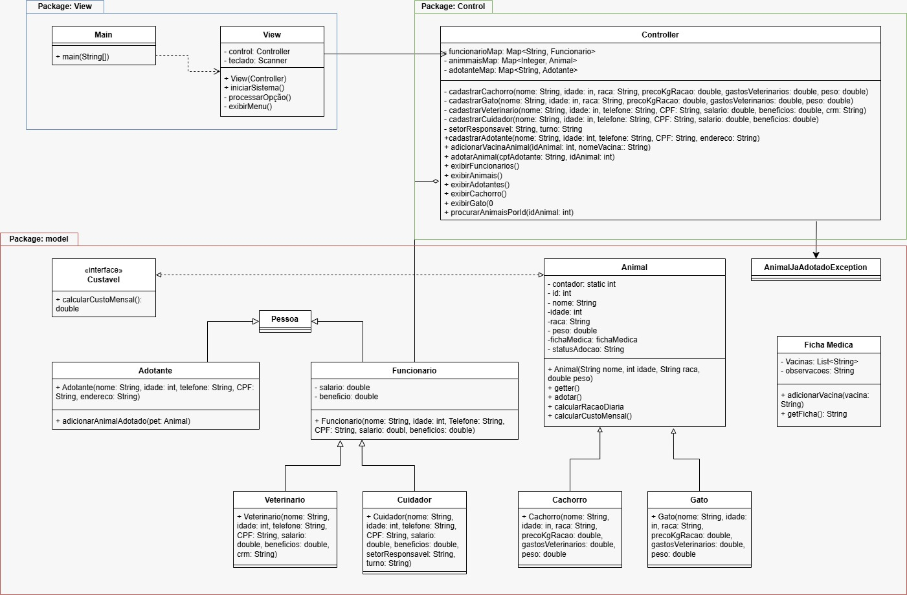
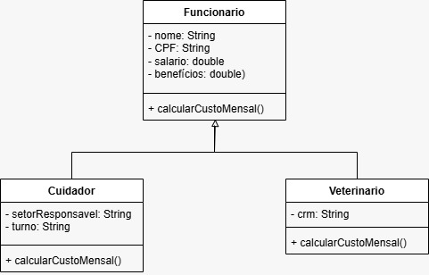
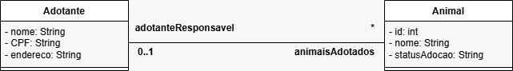

# AbrigoDeAnimais

### Intergrantes: Samuel Almeida de Lima, Fernando José Amurim Freitas, Mayane Cristina Lima Queiroz, Rhegys Patryck Oliveira Torres.

## 1. Descrição Geral do Problema e da Solução

### O Problema
No cenário atual, muitas Organizações Não Governamentais (ONGs) e abrigos voltados ao bem-estar animal enfrentam sérios problemas de gestão interna devido à falta de sistemas automatizados. O controle de animais disponíveis, históricos médicos, triagem de adotantes e a gestão financeira (envolvendo custos com alimentação e recursos humanos) costumam ser realizados de forma manual ou por meio de planilhas eletrônicas descentralizadas. Essa abordagem analógica resulta em perda de dados históricos, lentidão no processo de adoção, falhas no acompanhamento de vacinação e dificuldade em prever o orçamento mensal necessário para a manutenção do abrigo.

### A Solução
Para resolver esse problema, o grupo fez um Sistema de Gestão para Abrigo de Animais, usando Java e Orientação Objetos, fizemos o sistema no padrão arquitetural MVC. A solução automatiza todo o sistema do abrigo através de um programa java. O sistema permite o cadastro de animais (cachorros e gatos), funcionários (cuidadores e veterinários) e adotantes. Além de gerenciar o fluxo completo de adoção e atualizar em tempo real o status dos animais, o software conta com um sistema para calcular os custos mensais do abrigo de animais, além de gerenciar fichas médicas de cada animal.

---

## 2. Requisitos Funcionais (RF)

Os requisitos funcionais descrevem as ações e comportamentos que o sistema deve executar.

* **RF01 - Cadastrar Atores do Sistema:** O sistema deve permitir o cadastro de novos animais (identificando espécie, raça, peso e gerando um ID autoincrementado), funcionários (cuidadores com setor/turno e veterinários com CRM) e potenciais adotantes com validação de CPF único.
* **RF02 - Gerenciar Ficha Médica:** O sistema deve permitir que um funcionário do tipo Veterinário adicione registros de vacinas e observações clínicas à Ficha Médica individual de qualquer animal cadastrado no abrigo.
* **RF03 - Controlar Fluxo de Adoções:** O sistema deve permitir a realização de adoções vinculando o CPF de um adotante ao ID de um animal, alterando o status do animal de "Disponível" para "Adotado" e impedindo que animais já adotados passem pelo processo novamente.
* **RF04 - Emitir Relatórios e Consultas:** O sistema deve ser capaz de listar de forma filtrada todos os animais do abrigo, animais especificamente disponíveis, tipos de funcionários (veterinários ou cuidadores), adotantes, e permitir a busca individualizada de um animal por meio do seu ID único.
* **RF05 - Gerar Relatório Financeiro (Custo Mensal):** O sistema deve calcular de forma automatizada e polimórfica o custo mensal total do abrigo, somando os salários e benefícios dos funcionários com os custos individuais de alimentação (quilos de ração consumidos) e despesas veterinárias de cada animal resgatado.

## 3. Diagramas de Caso de Uso

Este diagrama ilustra os diferentes estados que um objeto "Animal" pode assumir no sistema, como "Cadastrado", "Disponível" para adoção e "Adotado", detalhando as transições acionadas por eventos como "Cadastrar animal", "AdicionarVacina" e "adotarAnimal".

Este diagrama apresenta as interações dos usuários do sistema com as funções de gerenciamento de pessoal e financeiro, incluindo o cadastro de funcionários especializados (Veterinário, Cuidador) e os cálculos de custo mensal, custo de animal e custo do abrigo.

Este diagrama descreve como os usuários (especialmente Veterinários e Funcionários) interagem com o sistema para gerenciar as fichas médicas dos animais, realizando ações como adicionar vacinas, consultar fichas, atualizar observações e registrar gastos veterinários.

Este diagrama mostra as interações gerais focadas nos animais, permitindo que os usuários realizem o cadastro de cachorros e gatos, gerenciem esses cadastros, procurem animais por ID e adicionem vacinas.

Este diagrama detalha o fluxo e as interações para o processo de adoção, incluindo o cadastro de adotantes, a listagem de animais disponíveis e a execução da adoção em si, com verificação de disponibilidade e tratamento de exceções.

## 4. Diagramas de classes

Este é o diagrama de classes completo do sistema, apresentando a arquitetura geral organizada em pacotes (View, Control, Model), mostrando todas as classes principais (Main, View, Controller, Pessoa, Adotante, Funcionario, Veterinario, Cuidador, Animal, Cachorro, Gato, Ficha Medica) e suas relações (herança, associação, agregação, composição, implementação de interface).

Este diagrama de classes foca especificamente na relação entre as classes Adotante e Animal, mostrando uma associação onde um adotante pode ser responsável por múltiplos animais e um animal pode ter um adotante responsável

Este diagrama de classes foca na estrutura de herança da classe Funcionario, mostrando que as classes Cuidador e Veterinario estendem Funcionario, herdando seus atributos e métodos, e implementando seus próprios métodos específicos de cálculo de custo mensal.

## 5. Manual de Usuário

Esse e o manual do usuario

### 5.1. Navegação geral e interface

Ao iniciar o sistema, você verá uma mensagem de boas-vindas. O sistema utiliza um fluxo de navegação baseado em "Enter para continuar". Toda vez que uma operação for concluída ou o menu for recarregado, o sistema aguardará que você pressione a tecla Enter para garantir que você consiga ler os dados na tela antes que o console exiba novas informações.
O menu principal é numérico (de 0 a 16):
Bem-vindo ao sistema do abrigo de animais!
Pressione enter para continuar. 

Menu:
1. Cadastrar Cachorro        2. Cadastrar Gato
3. Cadastrar Veterinário     4. Cadastrar Cuidador
5. Cadastrar Adotante        6. Adicionar vacina a um animal
7. Adotar animal             8. Listar animais
9. Listar funcionários       10. Listar Veterinários
11. Listar Cuidadores        12. Listar Adotantes
13. Listar Cachorros         14. Listar Gatos
15. Listar Animais Disponíveis para Adoção
16. Procurar animal por ID
0. Sair

Escolha uma opção:

### 3.3. Instruções de Uso das Funcionalidades

#### A. Fluxo de Cadastros (Opções 1 a 5)
Para cadastrar qualquer entidade (Animais, Funcionários ou Adotantes), digite o número correspondente à opção e preencha as perguntas solicitadas no terminal.

ID Automático: Você não precisa digitar o ID para cachorros e gatos. O sistema gera automaticamente um identificador numérico sequencial (Ex: ID: 1, ID: 2...) assim que o cadastro é finalizado.

Campos Específicos: Ao cadastrar um Cuidador (Opção 4), o sistema solicitará o Setor Responsável (ex: Gatil, Canil) e o Turno (ex: Manhã, Noite). Ao cadastrar um Veterinário (Opção 3), será solicitado o número do CRM.

#### B. Registro de Vacinação (Opção 6)
Para adicionar uma vacina ao histórico clínico de um animal:
Escolha a Opção 6.
Digite o ID numérico do animal (use a opção 8 ou 15 previamente para consultar o ID).
Digite o nome da vacina (Ex: Antirrábica, V10).
O sistema buscará o animal no banco de dados simulado e anexará a vacina à sua FichaMedica.

#### C. Processo de Adoção (Opção 7)
Esta funcionalidade realiza o vínculo definitivo de um animal a um adotante:
Escolha a Opção 7.
Digite o CPF exato do Adotante (ele deve ter sido cadastrado previamente na opção 5).
Digite o ID do animal desejado.
O sistema irá validar se o adotante e o animal existem, e se o animal está livre. Caso positivo, o status do animal mudará instantaneamente de Disponível para Adotado na lista geral.

#### D. Consultas e Listagens (Opções 8 a 16)
O sistema possui filtros avançados de exibição:
Opção 8, 13 e 14: Listam todos os animais, apenas cachorros ou apenas gatos, exibindo dados completos, o consumo de ração diária calculado por peso e o resumo da ficha médica.
Opção 15: Lista apenas os animais que ainda não foram adotados. Útil para o processo de triagem com novos adotantes.
Opção 16: Permite buscar um animal específico digitando apenas o seu ID, sem a necessidade de rolar por toda a lista do abrigo.
Opção 9, 10 e 11: Exibem listas de recursos humanos, calculando de forma transparente os salários, benefícios e o Custo Mensal que cada funcionário gera para a instituição.

### 3.4. Resolução de Problemas e Tratamento de Erros (Exceções)
O sistema conta com um mecanismo de segurança interna (Tratamento de Exceções) que impede que o programa feche sozinho caso o usuário digite algo incorreto.

Erro de Digitação (Letras em campos de Números): Se o sistema solicitar um valor numérico (como Idade, Peso, Salário ou ID) e você acidentalmente digitar letras (ex: "cinco") ou deixar em branco, o sistema capturará uma NumberFormatException. O programa exibirá um alerta amigável: Erro: Por favor, digite apenas números válidos! e retornará em segurança para o menu principal, sem perder os dados anteriores.

Tentativa de CPF Duplicado: O sistema gerencia adotantes e funcionários por chaves exclusivas. Se você tentar cadastrar duas pessoas com o mesmo CPF, a Controller disparará uma exceção de negócio, bloqueando a operação e informando que a chave já existe.

Animal inexistente ou já Adotado: Se você tentar vacinar ou adotar informando um ID inválido ou de um bicho que já foi adotado, o sistema acusará o erro na tela de forma limpa, protegendo a integridade das informações do abrigo.
